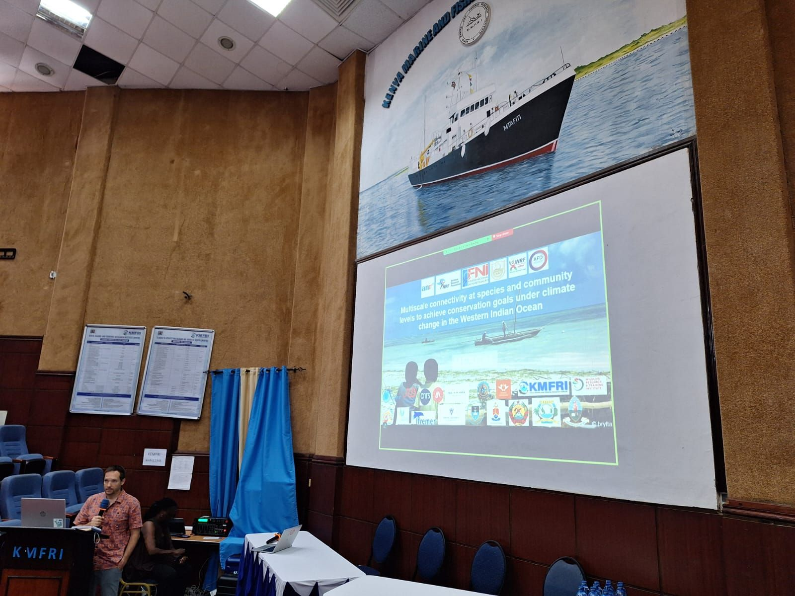
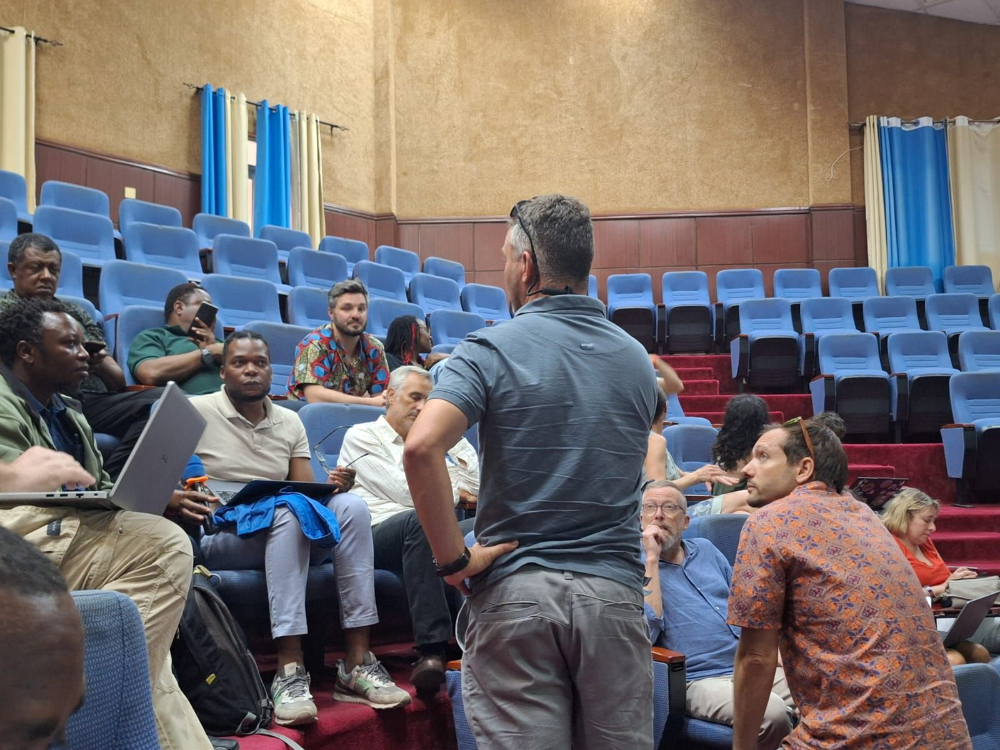
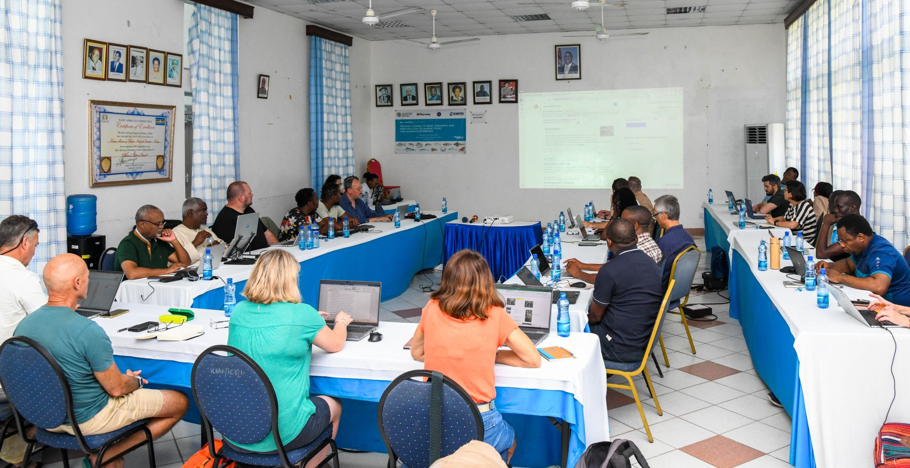

The **MESCAL** project (*Multiscale Connectivity at Species and Community Levels
to Achieve Conservation Goals under Climate Change*) was officially launched at
its kick-off meeting in Mombasa.

::: {.callout-note appearance="simple" title="At a glance"}
- <i class="fa-solid fa-users"></i> **Role** — Co-led with David Kaplan (MARBEC, IRD)
- <i class="fa-solid fa-earth-africa"></i> **Scope** — 15 institutions · 5 countries
- <i class="fa-solid fa-calendar-days"></i> **Kick-off** — 4–6 Oct 2025, KMFRI Mombasa
- <i class="fa-solid fa-hourglass-half"></i> **Duration** — 4 years
- <i class="fa-solid fa-hand-holding-dollar"></i> **Funding** — SIOMPA · AFD · ANR · NRF · COSTECH
:::

### The question

How can Marine Protected Areas (MPAs) and ecological connectivity enhance the
resilience of coastal marine ecosystems in the Western Indian Ocean to climate change?

### Objectives

- Model future temperature and larval connectivity from Kenya to South Africa
- Test whether MPAs safeguard high-performance fish, heat-tolerant genotypes, and key species
- Assess whether MPAs can prevent biodiversity and fisheries from tipping into collapse
- Co-design MPA networks that enhance climate resilience
- Integrate local ecological knowledge and stakeholder visions into marine spatial planning

### Approach

MESCAL combines physiology, otolith analysis, genomics, eDNA, ecosystem and
oceanographic/larval modeling, and local ecological knowledge with socio-economic
methods — underpinned by strong regional partnerships.

::: {layout-ncol="3"}
{group="mescal"}

{group="mescal"}

{group="mescal"}
:::

------------------------------------------------------------------------

[MESCAL project page](/projects/2025-mescal/) ·
[Official website](https://www.mescal-project.org/) ·
[Read on LinkedIn](LINKEDIN_POST_URL)