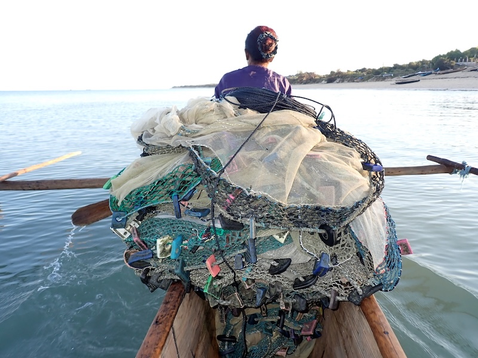

I am very pleased to share our latest article, published in **People and
Nature** and led by **Francéline Rasoanirina** as part of her Master's research
at the Institut Halieutique et des Sciences Marines (IH.SM) and IRD's
international joint laboratory **MIKAROKA**.

::: {.callout-note appearance="simple" title="At a glance"}
- <i class="fa-solid fa-book"></i> **Journal** — *People and Nature*
- <i class="fa-solid fa-user-pen"></i> **Lead author** — Francéline Rasoanirina (IH.SM / IRD LMI MIKAROKA)
- <i class="fa-solid fa-location-dot"></i> **Study site** — Ranobe Bay, southwestern Madagascar
- <i class="fa-solid fa-hand-holding-dollar"></i> **Funding** — IRD LMI MIKAROKA · University of Montpellier (KIM Sea & Coast, project FISHTAIL)
:::

### The practice

Mosquito net fishing is a widespread yet overlooked practice across tropical
coastal regions. Although frequently illegal, it persists because it provides
immediate benefits to vulnerable households. Its broader impacts remain poorly
understood, as few studies have examined its social, economic, and environmental
dimensions together.

### What we did

We investigated mosquito net fishing in Ranobe Bay, combining:

- Interviews with fishers
- Observations of fishing practices
- Catch and value-chain surveys

### Key findings

Our results highlight a difficult trade-off: the practice helps meet immediate
food and income needs, but may also contribute to long-term ecological
degradation and persistent poverty — what is often described as a
**socio-ecological trap**. The study also underscores the **central role of
women** in fishing, processing, and marketing activities, and their contribution
to household livelihoods.

### Implications

Addressing mosquito net fishing requires integrated solutions that support
vulnerable livelihoods, recognize gender roles, and promote sustainable,
inclusive fisheries management. This work owes a great deal to Francéline
Rasoanirina's outstanding field engagement and leadership throughout the project.

{group="fishtail"}

------------------------------------------------------------------------

[FISHTAIL project page](/projects/2022-fishtail/) ·
[Read the article](https://besjournals.onlinelibrary.wiley.com/doi/full/10.1002/pan3.70311)
[Plain language summary](https://relationalthinkingblog.com/2026/03/24/plain-language-summary-fishing-with-mosquito-nets-a-survival-strategy-that-risks-future-livelihoods-in-madagascar/)
[IRD Press release (in french)](https://www.ird.fr/le-paradoxe-de-la-peche-au-filet-moustiquaire-entre-subsistance-et-degradation-ecologique)
