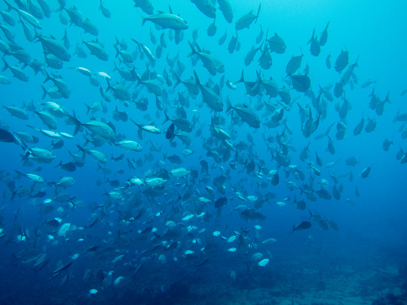

{.project-banner-img}

AIME pairs artificial intelligence with new biodiversity-sensing technologies, from environmental DNA to satellite imagery, to automatically generate indicators of marine ecosystem health and forecast how biodiversity responds to global change.

::: project-meta
<i class="fa-solid fa-calendar-days"></i> **Duration** February 2022 – December 2026\
<i class="fa-solid fa-hand-holding-dollar"></i> **Funding** AFD, via Expertise France (Challenge IA-Biodiv)\
<i class="fa-solid fa-coins"></i> **Budget** €649,898\
<i class="fa-solid fa-user-group"></i> **Role** WP co-lead, with Edi Prifti\
<i class="fa-solid fa-location-dot"></i> **Area** Mediterranean Sea and Pacific Ocean (New Caledonia)\
<i class="fa-solid fa-sitemap"></i> **Coordinator** Jihad Zahir (Cadi Ayyad University)
:::

## Summary

AIME develops artificial intelligence methods to automatically generate multi-scale indicators of marine ecosystem health, from environmental DNA to satellite imagery, and integrates them into a model able to explain and forecast the spatio-temporal dynamics of marine biodiversity, in support of coastal management decisions. Quantifying and forecasting changes in marine biodiversity faces two bottlenecks: conventional monitoring is labour-intensive and limited in space and time, and conventional models struggle to capture the full complexity of ecosystems across spatial, temporal, and organizational scales. AIME tackles both by turning data from emerging sensors, environmental DNA, underwater imagery, satellite imagery, acoustic telemetry, and even legal texts, into ecosystem-health indicators, and by integrating them into a probabilistic model of biodiversity dynamics. The project is carried out by a Franco-African consortium spanning France, Morocco, Senegal, and Cameroon, with a strong commitment to capacity building, and studies two contrasted regions: the Mediterranean Sea and the Pacific Ocean, with a focus on the New Caledonia EEZ.

## AI for eDNA biomonitoring

I co-lead, with Edi Prifti, the work package pairing AI with environmental DNA (eDNA) metabarcoding. eDNA offers a cost-effective way to monitor marine biodiversity, but it faces two challenges: the bioinformatic pipelines and taxonomic assignment steps remain complex and partly arbitrary, and linking eDNA signatures to the ecological status of ecosystems is still difficult. This component develops AI methods to address both, drawing on approaches originally designed for the human gut microbiome and adapting them to marine eDNA.

::: objectives
1.  **AI-based taxonomic assignment.** Develop AI as an alternative pipeline to assign sequences to taxa, reducing reliance on arbitrary thresholds and incomplete reference databases.
2.  **Predictive eDNA signatures.** Discover eDNA signatures that infer the status of marine ecosystems in the face of global change and management strategies such as marine protected areas, and explore them through networks of co-occurring species.
:::

## Partner organizations

AIME is carried out by a Franco-African consortium.

**France**

::: partner-grid
{target="_blank" title="IRD"} {target="_blank" title="UMR ENTROPIE"} {target="_blank" title="UMR MARBEC"} {target="_blank" title="UMMISCO"}
:::

**Morocco**

::: partner-grid

:::

**Senegal**

::: partner-grid
{target="_blank" title="Université Cheikh Anta Diop"} {target="_blank" title="Université Gaston Berger de Saint-Louis"}
:::

**Cameroon**

::: partner-grid

:::

## Team

- Estephe Kana Djifacka (PhD, University of Yaoundé I, Cameroon & IRD)
