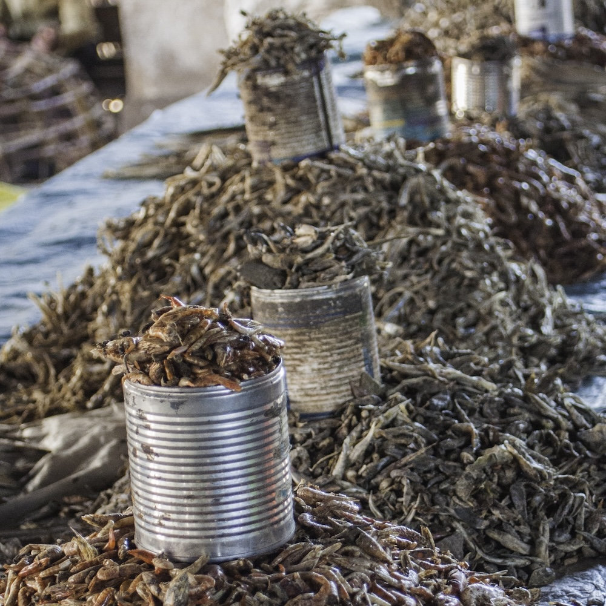
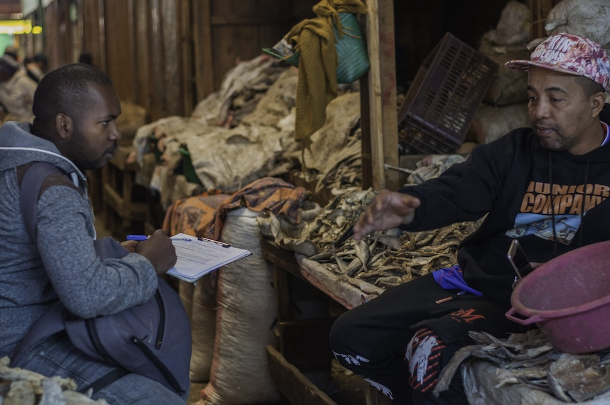

{.project-banner-img}

FISHTAIL explores the hidden diversity of small dried fishes in Madagascar, and asks whether they can carry essential micronutrients from coastal fisheries to inland communities.

::: {.project-meta}
<i class="fa-solid fa-calendar-days"></i> **Duration** January 2022 – December 2023  
<i class="fa-solid fa-hand-holding-dollar"></i> **Funding** Montpellier University of Excellence, KIM Sea & Coast  
<i class="fa-solid fa-coins"></i> **Budget** €23,000  
<i class="fa-solid fa-user-group"></i> **Role** PI  
<i class="fa-solid fa-location-dot"></i> **Area** Madagascar
:::

## Summary

Fish is a critical source of the micronutrients essential to human health, and fish consumption can reduce the micronutrient deficiencies responsible for a million deaths every year, especially in the poorest countries. Yet overfishing threatens this supply, creating a pressing need to balance sustainable fisheries with nutritional needs. Madagascar illustrates this tension: many small-scale fisheries are intensive and non-selective, and small fishes (under 8–12 cm) make up a large share of catches.

These small fishes are a potentially important but poorly understood part of the fishery. While some are kept locally, others are sun-dried and traded towards inland markets, travelling long distances and potentially supplying remote rural areas with critical micronutrients. Working across a 929 km coast-to-inland gradient, FISHTAIL combines molecular taxonomy, nutritional analysis, and socio-economic surveys to shed light on this unique link between marine ecosystems and human societies.

## Objectives

::: {.objectives}
1. **Taxonomic diversity.** Characterize the diversity of small dried fishes using molecular taxonomy.
2. **Nutritional value.** Quantify their micronutrient content and investigate how micronutrients transit from coastal to inland areas.
3. **Socio-economic value chains.** Examine how fishing practices, fishers' livelihoods, and the central role of women shape the trade and valorization of small fishes, and ultimately the taxonomic and nutritional diversity that reaches consumers from coastal to inland markets.
:::

By connecting ocean defaunation to human nutrition, FISHTAIL fills a critical knowledge gap for anticipating the impacts of overfishing on socio-ecological systems.

{width=70%}

## Partner organizations

**Madagascar**

::: {.partner-grid}
{target="_blank" title="Institut Halieutique et des Sciences Marines"}
:::

In partnership with [LMI MIKAROKA](https://mikaroka.ihsm.mg/){target="_blank"}, the IRD–IH.SM joint laboratory.

## Team

- Léono Todimazava (IH.SM)
- Franceline Rasoanirina (IH.SM)