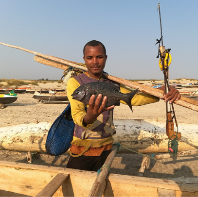
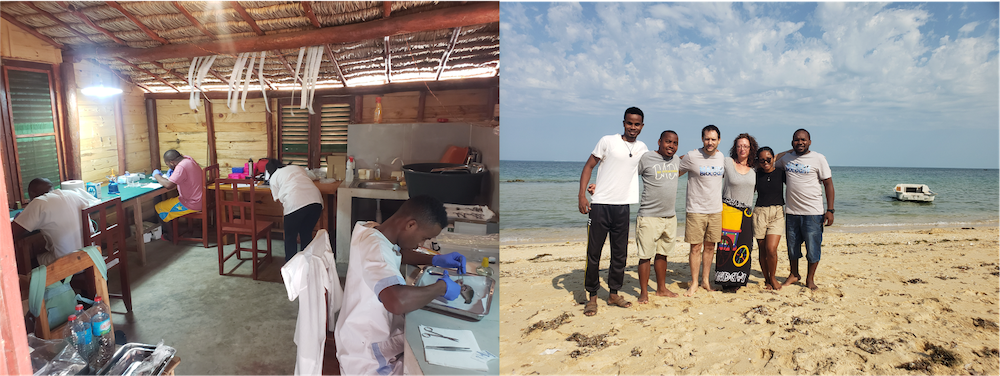

{.project-banner-img}

OVERFISH investigates how overfishing reshapes the trophic interactions between herbivorous fishes and algae on Madagascar's coral reefs, and what this means for reef resilience.

::: {.project-meta}
<i class="fa-solid fa-calendar-days"></i> **Duration** January 2024 – June 2025  
<i class="fa-solid fa-hand-holding-dollar"></i> **Funding** Montpellier University of Excellence  
<i class="fa-solid fa-coins"></i> **Budget** €15,000  
<i class="fa-solid fa-user-group"></i> **Role** PI  
<i class="fa-solid fa-location-dot"></i> **Area** Ranobe Bay, Madagascar
:::

## Summary

Herbivory is a key ecological process on coral reefs: by preventing algal overgrowth, it supports coral recruitment and underpins reef resilience. Yet our understanding remains limited, because herbivorous fishes are often lumped into broad functional groups that mask important ecological differences. We still know remarkably little about what most tropical herbivores actually eat, and how their diets differ within and among species.

How herbivores partition algal resources shapes the structure and stability of the herbivore–algae network. Low trophic overlap signals high complementarity, where the function depends on a diversity of species and species loss can be disruptive; high redundancy, on the contrary, can buffer reefs against biodiversity loss through functional compensation. OVERFISH addresses these gaps through two objectives.

## Objectives

::: {.objectives}
1. **Fine-scale trophic networks.** Use DNA metabarcoding of gut contents to reconstruct who eats what among the five most abundant herbivore species in Ranobe Bay, and quantify resource partitioning within and among species.
2. **Impact of overfishing.** Combine GPS tracking and participatory catch surveys to estimate fishing pressure on herbivores, then test how overfishing alters the structure and stability of the algae–herbivore network, and whether network reconfiguration can maintain herbivory.
:::

Together, these objectives yield insights into coral reef resilience, trophic dynamics, and the effects of fishing, with implications for sustainable fisheries management and conservation in Madagascar.

## Partner organizations

**Madagascar**

::: {.partner-grid}
{target="_blank" title="Institut Halieutique et des Sciences Marines"}
{target="_blank" title="Reef Doctor"}
:::

In partnership with [LMI MIKAROKA](https://mikaroka.ihsm.mg/){target="_blank"}, the IRD–IH.SM joint laboratory.

**France**

::: {.partner-grid}
{target="_blank" title="UMR AMURE"}
{target="_blank" title="UMR LEHNA, Université Lyon 1"}
:::

## Team

- Arthur Drouet (IRD)
- Kevine Nomenjanahary (IH.SM)
- Léono Todimazava (IH.SM)
- Franceline Rasoanirina (IH.SM)