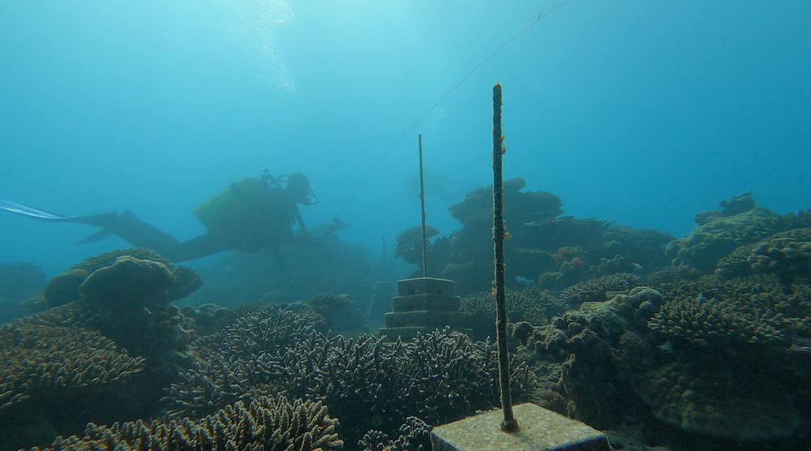
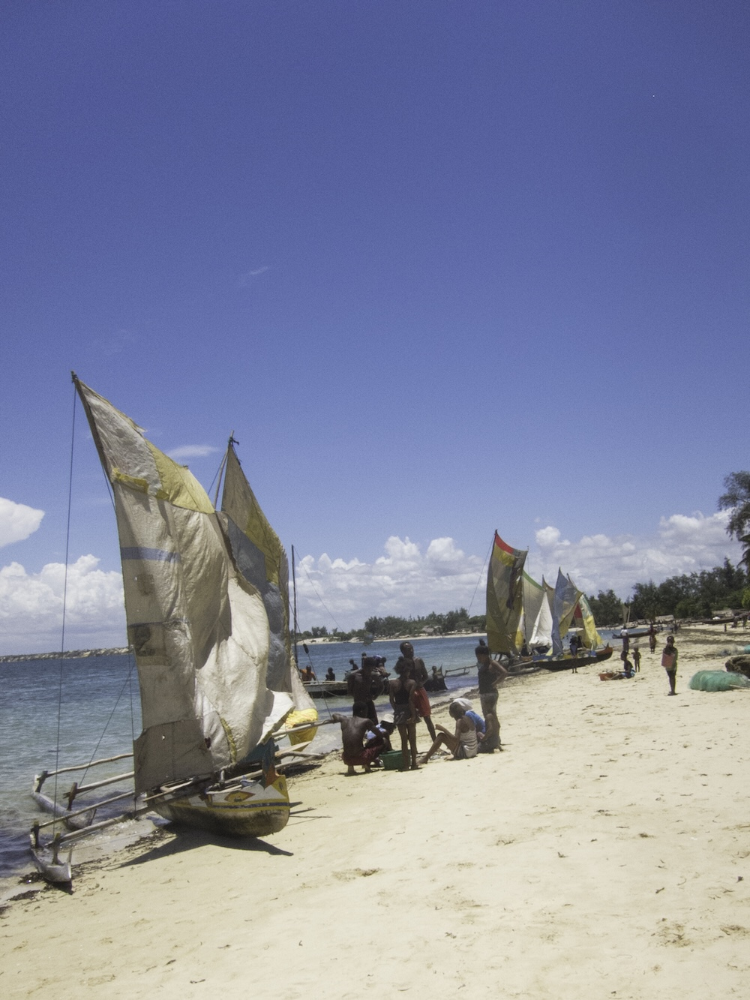

{.project-banner-img}

ARMS Resilience tackles the world's first documented climate-induced famine in southwest Madagascar, restoring coral reefs and enhancing marine food yields to strengthen the food security of coastal communities.

::: {.project-meta}
<i class="fa-solid fa-calendar-days"></i> **Duration** March 2025 – December 2029  
<i class="fa-solid fa-hand-holding-dollar"></i> **Funding** Belmont Forum (CEH2)  
<i class="fa-solid fa-coins"></i> **Budget** €1.48M (€401,000 IRD)  
<i class="fa-solid fa-user-group"></i> **Role** IRD PI  
<i class="fa-solid fa-location-dot"></i> **Area** Ranobe Bay, Madagascar  
<i class="fa-solid fa-globe"></i> **Website** [belmontforum.org](https://belmontforum.org/archives/news/arms-resilience-strengthening-reefs-and-food-systems-in-madagascar/)
:::

## Summary

{.float-right width=35%}

In southwest Madagascar, prolonged drought is driving agricultural failure and pushing Indigenous communities towards the coast, increasing pressure on already declining coral reefs. ARMS Resilience addresses this challenge as a question of resilience to global change at two interdependent levels: the resilience of coastal human communities, whose food security depends on the sea, and the resilience of the coral reefs they rely on, threatened by warming, overfishing, and pollution. Working with local communities, the project implements an ecosystem-scale reef restoration approach to enhance the yield of nutrient-rich marine foods, and builds a decision framework that combines scientific and Indigenous knowledge to meet nutritional needs in a changing climate, with a strong commitment to capacity building and to empowering women.

::: {.clearfix}
:::

## Reef resilience and the IRD component

{width=70% fig-align="center"}

The long-term sustainability of coral reefs depends on their resilience, their capacity to recover from disturbances such as the warming-driven bleaching events that are becoming more frequent under climate change. Two interconnected mechanisms are central to this resilience: coral recruitment, which allows reefs to recolonize after a disturbance, and herbivory, through which herbivorous fishes control algal growth and tip the coral–algae competition in favour of corals. Yet many herbivorous fishes, especially large species, are overfished, which can erode reef resilience and drive a shift towards macroalgae-dominated systems. Understanding how fishing pressure shapes coral recruitment and herbivory, and ultimately reef resilience, is therefore essential, in a region where reefs underpin both ecological functioning and local food security.

The IRD component of ARMS Resilience addresses these questions through four objectives.

:::: {.objectives}
1. **Site selection.** Select study sites along a gradient of fishing pressure.
2. **Herbivory and the algae–herbivore network.** Monitor herbivory and fish community structure through long-duration stereo-video surveys, quantifying grazing rates, biomass, and size structure, and characterize the algae–herbivore network that controls reef recovery.
3. **Coral recruitment and benthic communities.** Track coral recruitment and benthic community dynamics using artificial recruitment plates, photo-quadrats, and benthic transects.
4. **Nutritional value of aquatic foods.** Quantify the nutritional value of reef fish and other consumed aquatic foods, linking ecological data to household consumption surveys.
:::

## Partner organizations

**United States**

::: {.partner-grid}
{target="_blank" title="Perry Institute for Marine Science (coordinator)"}
{target="_blank" title="Harvard T.H. Chan School of Public Health"}
:::

**Madagascar**

::: {.partner-grid}
{target="_blank" title="Institut Halieutique et des Sciences Marines"}
{target="_blank" title="Reef Doctor"}
:::

**France**

::: {.partner-grid}
{target="_blank" title="IRD"}
{target="_blank" title="UMR MARBEC"}
:::

In partnership with [LMI MIKAROKA](https://mikaroka.ihsm.mg/){target="_blank"}, the IRD–IH.SM joint laboratory.

## Team

- Kevine Nomenjanahary (research engineer, IH.SM)
- Radonirina Lebely Botosoamananto (postdoc, IH.SM)
- Pierro Jules Tsimbazafihery (research engineer, IH.SM)
- Léono Todimazava (PhD, IH.SM/IRD)