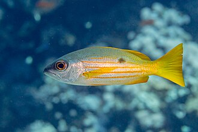
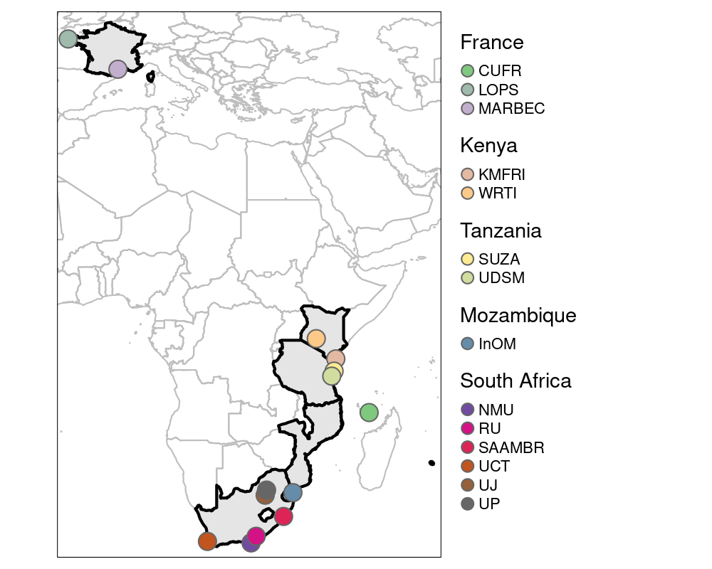

{.project-banner-img}

MESCAL asks how marine protected areas (MPAs) can help coastal ecosystems in the Western Indian Ocean withstand climate change, by safeguarding diversity at multiple levels, from genetic variation within species to whole communities, together with the connectivity that links populations across the seascape.

::: {.project-meta}
<i class="fa-solid fa-calendar-days"></i> **Duration** January 2025 – December 2029  
<i class="fa-solid fa-hand-holding-dollar"></i> **Funding** ANR, AFD, NRF, COSTECH, NRF Kenya  
<i class="fa-solid fa-coins"></i> **Budget** €1,000,000  
<i class="fa-solid fa-user-group"></i> **Role** PI with David Kaplan  
<i class="fa-solid fa-location-dot"></i> **Area** Kenya, Tanzania, Mozambique, South Africa  
<i class="fa-solid fa-globe"></i> **Website** [mescal-project.org](https://www.mescal-project.org/)
:::

## Summary

Climate change threatens the long-term sustainability of marine ecosystems. Marine protected areas (MPAs) are an effective tool to protect harvested species and biodiversity, but they were not designed to build resilience to climate change. A key open question is whether, and how, current and future MPAs can simultaneously buffer **intraspecific diversity** (genotypes and phenotypes) and **community diversity** against climate change. Connectivity plays a pivotal role here, by allowing individuals from climate or fishing refugia to repopulate impacted areas. These questions are especially pressing in the Western Indian Ocean (WIO), where warming and fishing are increasing rapidly and where fish are the primary source of protein and income for coastal communities.

Focusing on the eastern African coastline from Kenya to South Africa, MESCAL addresses five interconnected objectives.

## Objectives

::: {.objectives}
1. **Future projections.** Produce high-resolution projections of future environmental conditions and connectivity.
2. **Climate-resilient individuals.** Test whether MPAs harbour individuals of high physiological performance, and identify the genetic origins of these traits.
3. **Safeguarding key species.** Test whether MPAs protect ecologically important and vulnerable species, and prevent ecosystems and fisheries from crossing climate tipping points.
4. **Connectivity & resilience.** Assess how the connectivity of current and future MPA networks enhances resilience at the species and community levels.
5. **Stakeholder preferences.** Quantify stakeholders' preferences for spatial management options through bilateral exchanges across the WIO.
:::

The project brings together **10 funded partners, 5 collaborating partners and many participants** across France, South Africa, Mozambique, Tanzania and Kenya, building on existing programs and strong relationships with MPA authorities in the region.
  
::: {.project-keywords}
Keywords: climate change, marine spatial planning, larval dispersal, genomics, environmental DNA, fish physiology, hydrodynamic and dispersal models, species distribution and ecosystem models, local ecological knowledge, discrete choice experiments.
:::

## Partner organizations

The project involves 15 partners across 5 countries.

**France**

::: {.partner-grid}
{target="_blank" title="UMR MARBEC"}
{target="_blank" title="IRD"}
{target="_blank" title="CUFR Mayotte"}
{target="_blank" title="SeBiMER, Ifremer"}
{target="_blank" title="UMR LOPS"}
:::

**South Africa**

::: {.partner-grid}
{target="_blank" title="Nelson Mandela University"}
{target="_blank" title="Rhodes University"}
{target="_blank" title="SAAMBR"}
{target="_blank" title="University of Cape Town"}
{target="_blank" title="University of Johannesburg"}
{target="_blank" title="University of Pretoria"}
:::

**Mozambique**

::: {.partner-grid}
{target="_blank" title="Instituto Oceanográfico de Moçambique"}
:::

**Tanzania**

::: {.partner-grid}
{target="_blank" title="State University of Zanzibar"}
{target="_blank" title="Institute of Marine Sciences, UDSM"}
:::

**Kenya**

::: {.partner-grid}
{target="_blank" title="KMFRI"}
{target="_blank" title="WRTI"}
:::

