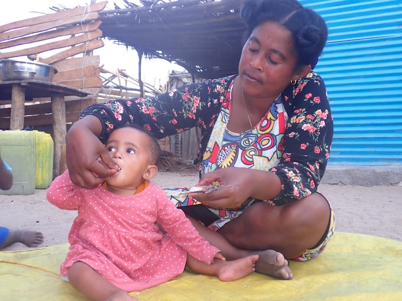

{.project-banner-img}

AQUANUT asks how aquatic foods, fresh and processed, travel from the coast to inland communities of southern Madagascar, and how much they contribute to the nutrition of the most vulnerable: young children and women of childbearing age.

::: {.project-meta}
<i class="fa-solid fa-calendar-days"></i> **Duration** May 2025 – May 2028  
<i class="fa-solid fa-hand-holding-dollar"></i> **Funding** UNICEF Madagascar  
<i class="fa-solid fa-coins"></i> **Budget** €170,000  
<i class="fa-solid fa-user-group"></i> **Role** Co-PI, with Claire Mouquet-Rivier  
<i class="fa-solid fa-location-dot"></i> **Area** Atsimo-Andrefana, southwest Madagascar
:::

## Summary

Aquatic foods are a key source of protein, essential fatty acids, and micronutrients for vulnerable populations, and processing them through drying or smoking allows these nutrients to travel far inland, often hundreds of kilometres from where the fish were caught. Yet their contribution to nutrition remains poorly measured: national surveys make them invisible by grouping them with meat, and little is known about the nutritional and safety quality of these processed products in Madagascar, where child stunting is among the highest in the world. At the same time, the accelerating degradation of marine habitats and overfishing threaten access to these nutritionally critical foods. Working across six sites along a coast-to-inland gradient, AQUANUT combines consumption surveys, nutritional analyses, and participatory approaches at the interface of biodiversity, small-scale fisheries, food, and nutrition.

## Objectives

::: {.objectives}
1. **Consumption and nutritional status.** Identify the determinants of aquatic-food consumption (access, preferences) among women of childbearing age and children aged 6-23 months, and characterize consumption patterns, quantities, and nutritional status across households.
2. **Nutritional quality.** Assess the contribution of aquatic foods to nutrient requirements from consumption data.
3. **Participatory recommendations.** Identify processing methods and products that can be valorized, and co-build practical consumption recommendations with local communities.
:::

This project is the empirical core of the PhD of Léono Todimazava.

## Partner organizations

::: {.partner-grid}
{target="_blank" title="UNICEF Madagascar"}
{target="_blank" title="IRD"}
{target="_blank" title="UMR MARBEC"}
{target="_blank" title="UMR QUALISUD"}
{target="_blank" title="Institut Halieutique et des Sciences Marines"}
{target="_blank" title="GRET Madagascar"}
:::

In partnership with [LMI MIKAROKA](https://mikaroka.ihsm.mg/){target="_blank"}, the IRD-IH.SM joint laboratory.

## Team

- Léono Todimazava (PhD, IRD ARTS fellowship, University of Toliara)
- Faustine Rio Puygrenier (IRD VIE)
